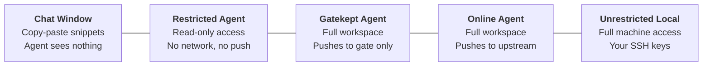
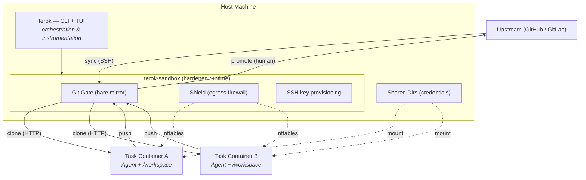
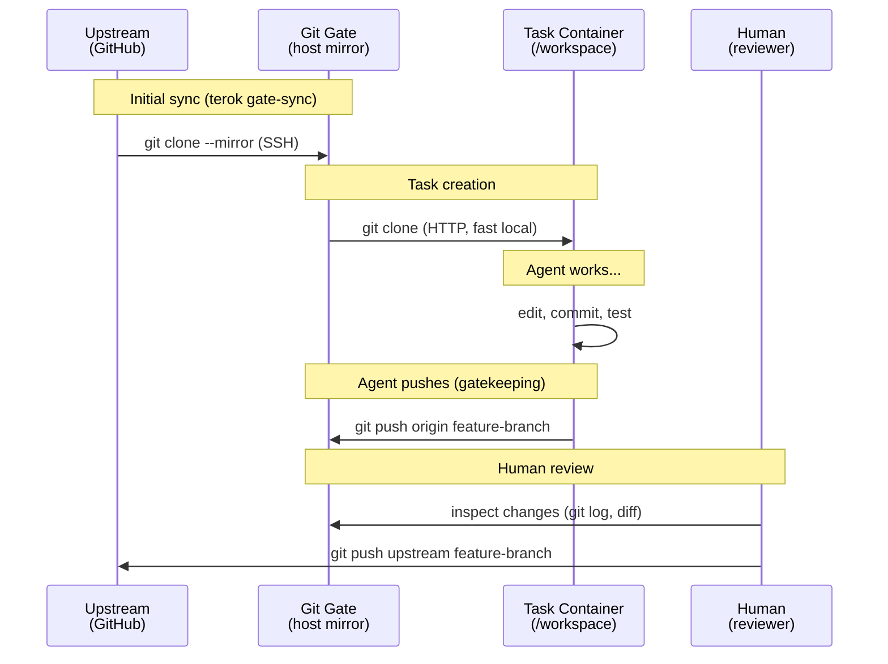
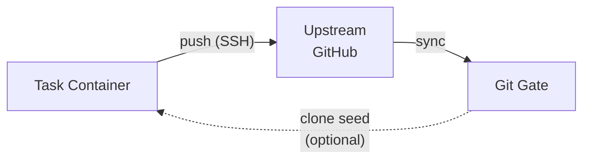
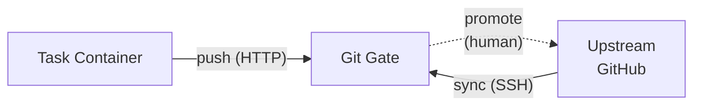
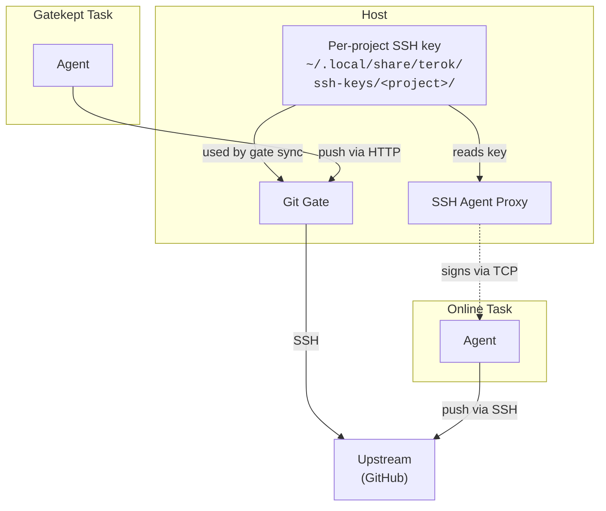
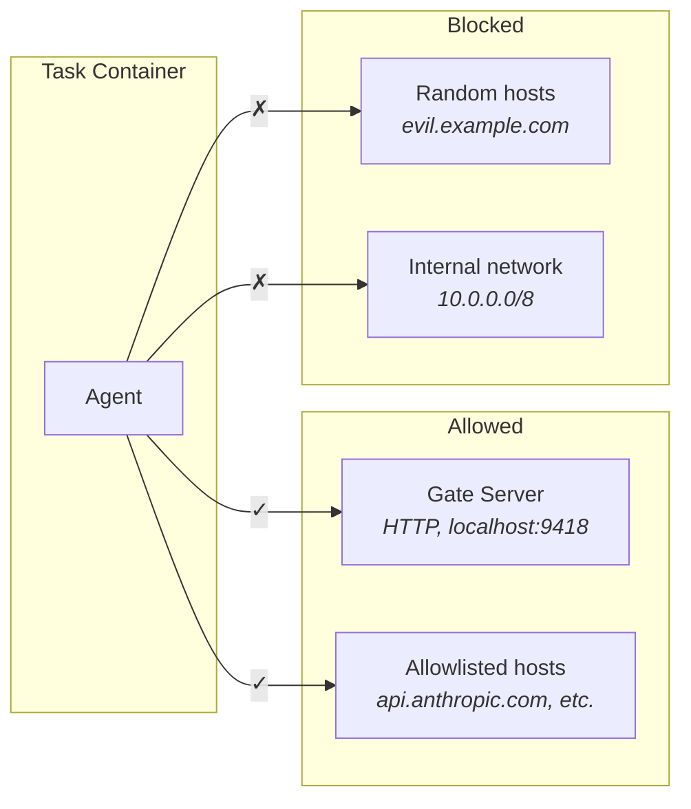
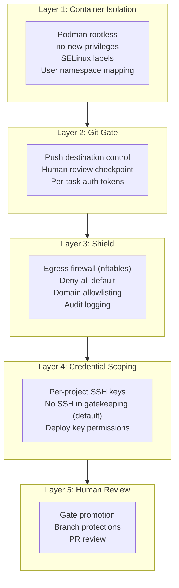
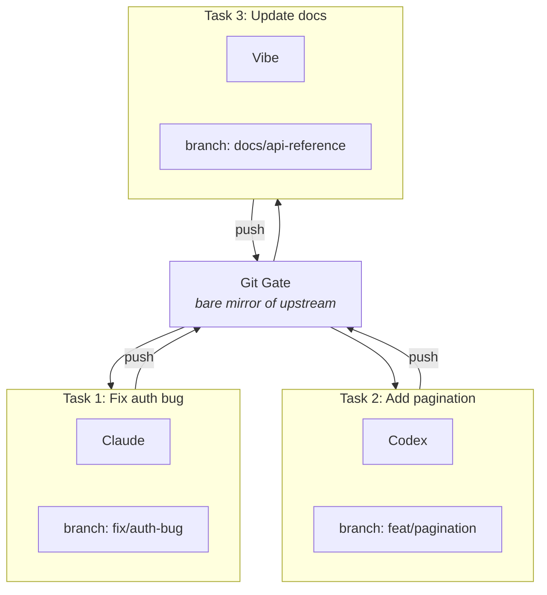
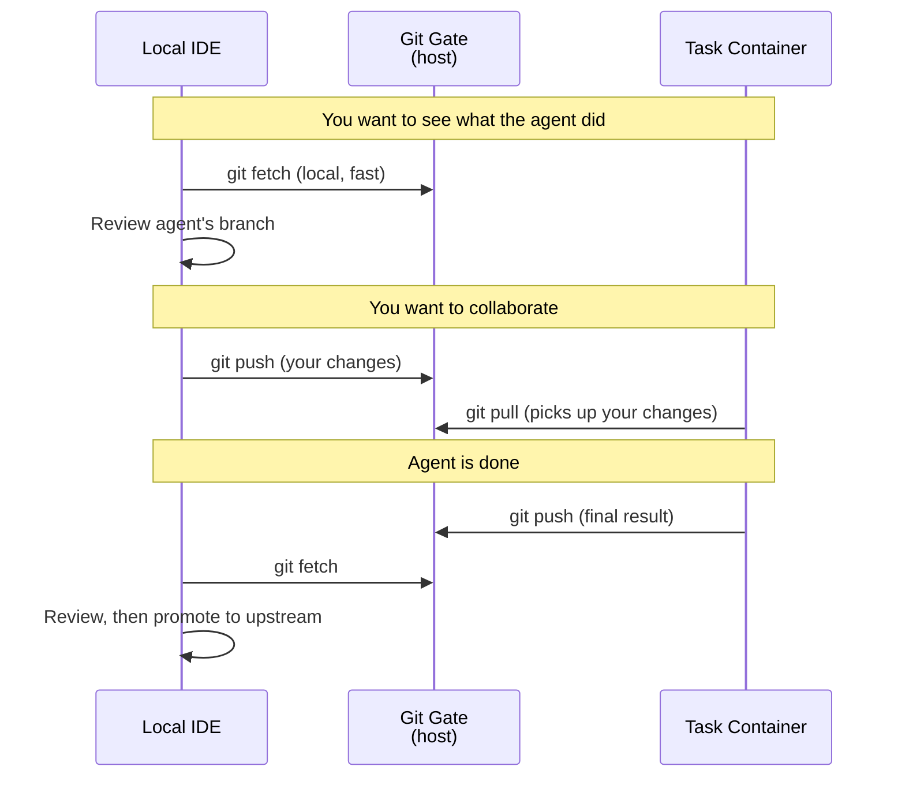

# Concepts

This page explains the core ideas behind terok — why containerized agents
exist, what problems they solve, and how terok's architecture maps to
real-world workflows.

---

## The Problem: Agents Need Access, Access Creates Risk

AI coding agents need to read code, run tools, install packages, and push
commits. Giving an agent direct access to your machine is the fastest way
to get work done — but it is also the fastest way to lose control:

- The agent can read and exfiltrate secrets (SSH keys, API tokens, cloud
  credentials) from the host filesystem.
- A prompt-injection attack can turn the agent into an attacker with full
  access to your network.
- A misunderstood instruction can delete files, force-push branches, or
  modify system configuration.
- Multiple agents working in parallel can step on each other's changes.

The alternative — copy-pasting code back and forth in a chat window — is
safe but painfully slow, and the agent cannot run tests, lint, or interact
with the real development environment.

terok exists in the space between these two extremes.

---

## The Spectrum of Agent Autonomy

There is no single "right" level of agent access. The appropriate level
depends on how much you trust the agent, the sensitivity of the codebase,
and how much friction you are willing to tolerate.



| Level | Agent can | Agent cannot | Use case |
|-------|-----------|-------------|----------|
| **Chat window** | Read pasted snippets | See files, run tools, push code | Quick questions, small edits |
| **Restricted** | Read code, run tests | Write to git, access network | Code review, analysis |
| **Gatekept** (terok default) | Edit code, push to gate | Push to upstream, access arbitrary hosts | Autonomous development with human review |
| **Online** | Edit code, push to upstream | Escape the container | Trusted agents, CI-like workflows |
| **Unrestricted local** | Everything on the machine | Nothing is off-limits | Dangerous — no isolation at all |

terok provides the **gatekept** and **online** levels, with configurable
options to tune the exact trade-off within each.

---

## Architecture Overview

terok is split into two packages:

- **terok** — orchestration and instrumentation: agent configuration,
  task lifecycle, image building, instructions, presets, CLI and TUI.
- **[terok-sandbox](https://github.com/terok-ai/terok-sandbox)** — hardened
  container runtime: Podman lifecycle, egress firewall (via
  [terok-shield](https://github.com/terok-ai/terok-shield)), gated git
  access, SSH key provisioning.

The arrows show how code flows between components:



---

## Core Concepts

### Projects

A **project** is a configuration that maps to a single upstream git
repository. It defines:

- The upstream URL and default branch
- The security mode (online or gatekeeping)
- SSH key configuration
- Agent settings (provider, model, instructions)
- Shield allowlists

Projects are stored as YAML files under
`~/.config/terok/projects/<id>/project.yml`. A project can have many tasks
running simultaneously, all against the same upstream repo.

### Tasks

A **task** is a single unit of work inside a project. Each task gets:

- Its own **Podman container** — fully isolated from other tasks
- Its own **workspace directory** — a fresh clone of the repo,
  checked out at the project's configured branch

The starting branch is configured per project (not per task). All tasks
in a project begin at the same branch — agents typically create their
own feature branches from there, but this is a convention, not an
enforcement.
See [#295](https://github.com/terok-ai/terok/issues/295) for planned
per-task branch selection.

Tasks are the primary unit of lifecycle management: you create, start,
stop, follow up on, and archive tasks.

### Task Workspace

The workspace is the task's private copy of the codebase, mounted at
`/workspace` inside the container. On the host it lives at:

```text
~/.local/share/terok/tasks/<project>/<task_id>/workspace-dangerous/
```

The `-dangerous` suffix is a deliberate reminder: this directory contains
whatever the agent produces, which may include malicious content. The
container has full read-write access to its own workspace, but cannot see
other tasks' workspaces.

---

## The Git Gate

The **git gate** is a host-side bare mirror of the upstream repository. It
sits between the containers and the real remote, acting as either a
performance accelerator or a security checkpoint depending on the mode.

### How code flows through the gate



### Gate in online mode

In online mode, the gate is optional. When present, it speeds up the
initial clone (local HTTP is faster than fetching from GitHub), but the
container's `origin` remote is repointed to upstream after cloning. The
agent pushes directly to GitHub.

### Gate in gatekeeping mode

In gatekeeping mode, the gate is the **only** remote the container can
push to. The container's `origin` points to the gate server's HTTP
endpoint. All changes must pass through human review before reaching
upstream.

!!! tip "The gate is not a hard barrier"
    The gate controls which remote is configured as `origin`. It does not
    physically prevent the agent from adding other remotes. To enforce
    the boundary, combine the gate with the **shield** (egress firewall)
    to block outbound network access.

---

## Security Modes

### Online mode



- Container has SSH access via the credential proxy's SSH agent
- Agent can push branches directly to upstream
- Gate is a performance optimisation only
- Security relies on upstream branch protections and deploy-key scoping
- No human review checkpoint

**Use when:** you trust the agent, the deploy key has limited permissions,
and upstream has branch protection rules.

### Gatekeeping mode



- Container has no SSH keys (by default)
- Agent can only push to the gate
- Human reviews changes before promoting to upstream
- Network egress blocked by the shield (deny-all default)

**Use when:** you want human review of every change, or when working
with sensitive codebases.

### Gatekeeping options

| Option | Effect |
|--------|--------|
| SSH key registered via `ssh-init` | SSH agent proxy available in gatekeeping. Useful for private submodules. **Risk:** if the key has write access to upstream, the agent could bypass the gate. |
| `gatekeeping.expose_external_remote: true` | Add upstream as a read-only `external` remote. The agent can pull from upstream but `origin` still points to the gate. |
| `gatekeeping.auto_sync` | Automatically update the gate when upstream changes are detected. |

### Mode combinations at a glance

=== "Online"

    | Configuration | Pathway | Notes |
    |:---|:---|:---|
    | **default** | `Upstream ←SSH→ Gate →HTTP→ Task →SSH→ Upstream` | Gate seeds clone, then task talks to upstream directly |
    | **no gate** | `Upstream ←SSH→ Task` | Task clones and pushes to upstream directly |

=== "Gatekeeping"

    | Configuration | Pathway | Notes |
    |:---|:---|:---|
    | **default** | `Upstream ←SSH→ Gate ←HTTP→ Task` | Task cannot reach upstream |
    | | `Gate —human→ Upstream` | Promotion is manual |
    | **+ external remote** | `Upstream ←SSH→ Gate ←HTTP→ Task` | `origin` still points to gate |
    | | `Task —fetch→ Upstream` | Read-only upstream visibility |
    | **+ SSH key** | `Upstream ←SSH→ Gate ←HTTP→ Task` | `origin` still points to gate |
    | | `Task —SSH agent→ Upstream` | **Risk:** if key has push access, agent can bypass gate |

---

## SSH Keys and Who Knows What

SSH keys control access to private git repositories. terok generates a
separate key per project (`terok ssh-init`); keys remain on the host and
are served to containers via the credential proxy's SSH agent.



| Mode | Container has SSH access? | Agent can reach upstream? |
|------|----------------------|--------------------------|
| **Online** | Yes — via SSH agent proxy | Yes — push via SSH |
| **Gatekeeping** | No (default) | No — push only to gate via HTTP |
| **Gatekeeping + SSH key** | Yes — via SSH agent proxy (opt-in) | Potentially — depends on key permissions |

The gate itself always has access to the SSH key (it needs it to sync with
upstream). The key question is whether the **container** also has SSH agent
access. Private keys never enter the container — the proxy signs on behalf
of the container.

---

## The Shield (Egress Firewall)

The **shield** is an nftables-based egress firewall provided by
[terok-shield](https://github.com/terok-ai/terok-shield) and integrated
through terok-sandbox. It restricts outbound network connections from
containers via Podman OCI hooks — rules are applied automatically when
containers start.



| Shield state | Outbound traffic | Audit logging | Risk |
|-------------|------------------|---------------|------|
| **Up** (deny-all) | Allowlisted only | Yes | Low |
| **Down** (bypass) | All allowed | Yes | High |
| **Disabled** | All allowed | No | Highest |

The shield reduces exposure to:

- **Secrets exfiltration** — a compromised agent cannot send your API keys
  to an external server
- **Prompt injection surface** — the agent cannot fetch content from
  arbitrary URLs, reducing (but not eliminating) the risk of injection
  via attacker-controlled web content. This is a best-effort indirect
  measure — prompt injection can occur even via legitimate allowlisted
  sites, and reliable mitigation ultimately depends on the LLM itself
- **Internal network scanning** — RFC 1918 (IPv4) and RFC 4193 (IPv6)
  private ranges are blocked by default
- **Uncontrolled package downloads** — the agent cannot freely install
  from arbitrary registries, though this is an egress restriction, not
  a full supply-chain security solution

See the [Shield Security](shield-security.md) page for a complete
threat model.

---

## Defence in Depth

No single security layer is sufficient. terok and terok-sandbox combine
multiple independent layers, each covering different attack vectors:



| Attack vector | Gate | Shield | Container isolation | Credential scoping |
|---------------|------|--------|--------------------|--------------------|
| Push malicious code to upstream | Blocks (gatekeeping) | — | — | Deploy key perms |
| Exfiltrate secrets over network | — | Blocks | — | No keys mounted |
| Escape to host filesystem | — | — | Blocks (rootless, namespaces) | — |
| Scan internal network | — | Blocks (RFC 1918/4193) | — | — |
| Tamper with other tasks | — | — | Blocks (separate containers) | — |
| Prompt injection via internet | — | Reduces surface (allowlist) | — | — |

---

## Shared Directories

Some configuration and credentials need to be shared across tasks. terok
mounts two kinds of shared directories into containers:

### Global shared directories

These are shared by **all tasks across all projects** and contain
agent credentials and configuration:

```text
~/.local/share/terok/envs/
├── _claude-config/    → /home/dev/.claude      (Claude Code)
├── _codex-config/     → /home/dev/.codex       (Codex)
├── _vibe-config/      → /home/dev/.vibe        (Mistral Vibe)
├── _gh-config/        → /home/dev/.config/gh   (GitHub CLI)
└── ...
```

These directories persist across container restarts and task
recreation. When you log in to an agent provider in one container, the
credentials are available in all future containers.

### Per-project SSH keys

SSH keys are scoped per project and stored on the host only:

```text
~/.local/share/terok/ssh-keys/
└── myproject/
    ├── id_ed25519        (private — never leaves the host)
    ├── id_ed25519.pub
    └── config
```

Each project has its own SSH key, generated by `terok ssh-init`.
Keys are served to containers via the SSH agent proxy.

### Task-private directories

The workspace itself is private to each task:

```text
~/.local/share/terok/tasks/<project>/<task_id>/
├── workspace-dangerous/  → /workspace          (repo clone)
├── agent-config/                                (agent state)
└── shield/                                      (firewall audit logs)
```

No other task can see or modify another task's workspace.

---

## Multi-Task Parallel Work

One of terok's core use cases is running multiple agents in parallel
against the same repository. Each task starts from the same project
branch, but agents typically create their own feature branches:



Each task:

- Runs in its own container — agents cannot interfere with each other
- Gets its own workspace — a separate clone of the same repo
- Has its own shield rules — network restrictions are per-container
- Can use a different agent provider — mix Claude, Codex, and Vibe in
  the same project

Branching is not enforced by terok — it is up to the agent to create a
feature branch. Most agents do this by convention when given a task
description.

---

## IDE and Local Development Integration

terok containers are not opaque boxes. You can interact with task
workspaces from your local IDE or terminal through the git gate:



The gate is a standard git repository. Any git client — your IDE,
`git` CLI, or a GUI tool — can interact with it using normal git
operations.

---

## Comparison: terok vs. Alternatives

| Capability | Chat window | Agent on bare metal | Docker-based tools | **terok** |
|------------|-------------|--------------------|--------------------|-----------|
| Agent runs tests | No | Yes | Yes | Yes |
| Agent installs packages | No | Yes (risky) | Yes | Yes |
| Agent pushes to GitHub | No | Yes (risky) | Varies | Configurable |
| Parallel agents | No | Manual | Varies | Built-in |
| Human review checkpoint | N/A | No | Varies | Gate (gatekeeping) |
| Egress firewall | N/A | No | Rare | Shield |
| No root/daemon required | N/A | N/A | Docker needs daemon | Podman rootless |
| Multi-vendor agents | N/A | One at a time | Usually one | Claude, Codex, Copilot, Vibe, Blablador |
| Per-task workspace isolation | N/A | Manual | Varies | Automatic |

---

## Next Steps

- [Getting Started](usage.md) — set up your first project and run a task
- [Security Modes](git-gate-and-security-modes.md) — detailed
  online vs. gatekeeping configuration
- [Shield Security](shield-security.md) — egress firewall threat model
- [Container Layers](container-layers.md) — how container images are built
- [Shared Directories](shared-dirs.md) — volume mounts reference
